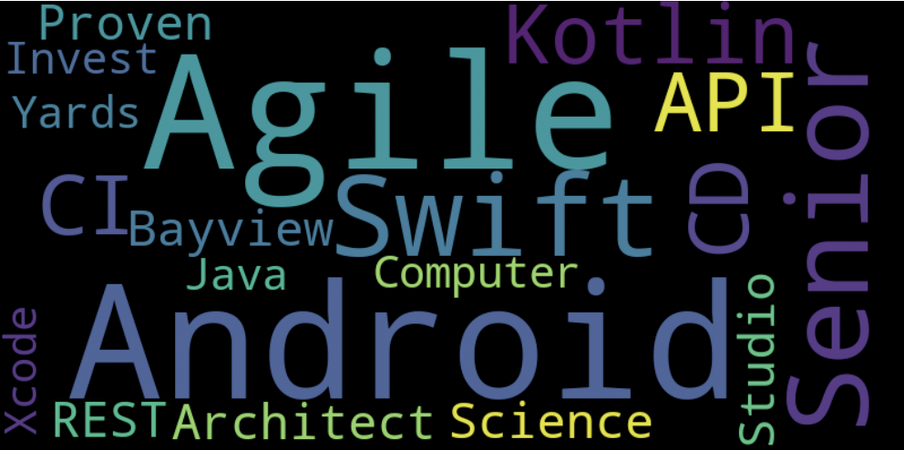

# JobDescriptionAnalysis
Job Description Analysis in python, NLTK and Term Frequency

Often candidates wonder what words are important that will be capture the attention of recruiter, so therefore thought of taking multiple job descriptions realted to Android developement position, and perform text analysis on those descriptions to get words that are important in those job descriptions.

#Tech Stack:
* Python
* NLTK
* TermFrequency - shows how frequently an expression (term, word) occurs in a document.

Result:

Used word cloud to visualize the top 20 keywords from job description.

